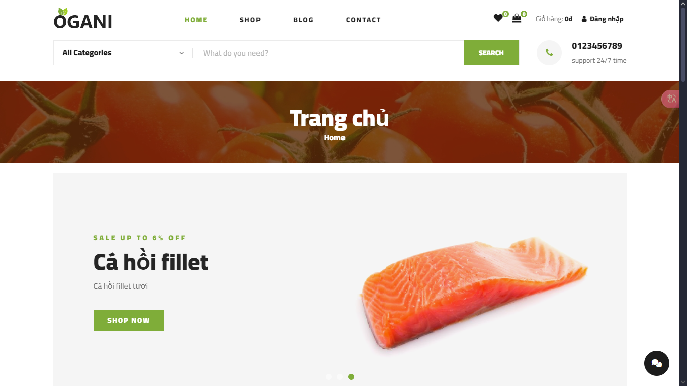

# Website Thương Mại Điện Tử Ogani 🛒

## Tổng Quan Dự Án
Ogani là nền tảng thương mại điện tử hiện đại chuyên về các sản phẩm hữu cơ và thực phẩm tươi sống. Được xây dựng bằng Laravel và MySQL, website này mang đến trải nghiệm mua sắm mượt mà cho khách hàng đang tìm kiếm các sản phẩm hữu cơ chất lượng.



## 🎯 Tính Năng Chính

### Dành Cho Khách Hàng
- **Duyệt Sản Phẩm**
  - Điều hướng theo danh mục
  - Tìm kiếm nâng cao
  - Lọc và sắp xếp sản phẩm
  - Thông tin chi tiết sản phẩm
  - Gợi ý sản phẩm liên quan

- **Trải Nghiệm Mua Sắm**
  - Giỏ hàng thân thiện người dùng
  - Tính toán giá thời gian thực
  - 2 phương thức thanh toán
  - Chức năng danh sách yêu thích

- **Quản Lý Tài Khoản**
  - Đăng ký và đăng nhập an toàn
  - Quản lý hồ sơ cá nhân
  - Lịch sử đơn hàng
  - Sổ địa chỉ
  - Quản lý danh sách yêu thích

### Dành Cho Quản Trị Viên
- **Quản Lý Sản Phẩm**
  - Thêm/Sửa/Xóa sản phẩm
  - Quản lý danh mục

- **Quản Lý Đơn Hàng**
  - Xử lý đơn hàng
  - Cập nhật trạng thái
  - Liên lạc với khách hàng
  - Tạo hóa đơn
  - Theo dõi thanh toán

## 💻 Công Nghệ Sử Dụng
- **Backend**
  - Laravel Framework
  - PHP 8.0+
  - MySQL Database

- **Frontend**
  - HTML5, CSS3, JavaScript
  - Bootstrap
  - jQuery
  - AJAX
  - Thiết kế responsive

- **Bảo Mật**
  - Xác thực người dùng
  - Mã hóa dữ liệu
  - Bảo vệ XSS
  - Bảo vệ CSRF
  - Xử lý thanh toán an toàn

## 🎨 Đặc Điểm Thiết Kế
- Giao diện hiện đại và sạch sẽ
- Bố cục thích ứng di động
- Điều hướng thân thiện người dùng
- Hiển thị sản phẩm tối ưu
- Quy trình thanh toán trực quan

## 🚀 Phát Triển Tương Lai
- Hỗ trợ đa ngôn ngữ
- Hệ thống đề xuất nâng cao
- Phát triển ứng dụng di động
- Tích hợp mạng xã hội
- Bảng điều khiển phân tích nâng cao

### Cài đặt

1. **Clone the repository**:
    ```bash
    git clone https://github.com/minhdat204/Ecommerce_project.git
    cd Ecommerce_project
    ```

2. **Install PHP dependencies**:
    ```bash
    composer install
    ```

3. **Install Node dependencies**:
    ```bash
    npm install
    ```

4. **Copy .env file**:
    ```bash
    cp .env.example .env
    ```

5. **Generate application key**:
    ```bash
    php artisan key:generate
    ```

6. **Configure your environment variables in `.env`**:
    - Set your database credentials
    - Set other necessary configurations

7. **Run database migrations**:
    ```bash
    php artisan migrate
    ```

8. **Run the development server**:
    ```bash
    php artisan serve
    ```

### Additional Commands
- **Compile assets**:
    ```bash
    npm run dev
    ```
